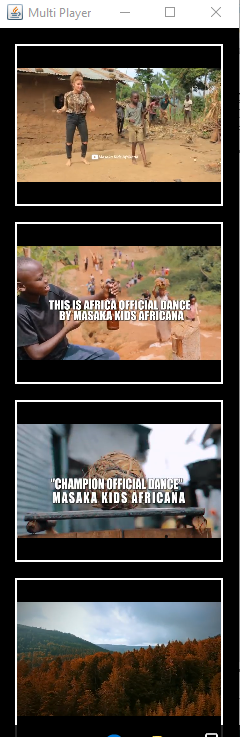

# Prerequisites
* Java 8
* Maven

# vlc4jer
How to use vlc4j 

## How to run it
* runTest.bat
* or runTest.sh

* How to customise it
```
<execution>
						<phase>test</phase>
						<goals>
							<goal>java</goal>
						</goals>
						<configuration>
							<mainClass>org.deb.multiplayer.MPlayer</mainClass>
							<arguments>
							    <argument>https://www.youtube.com/watch?v=4-hQFOaJyxQ</argument>
							    <argument>https://www.youtube.com/watch?v=IkOlwbjUofI</argument>
							    <argument>https://www.youtube.com/watch?v=jlwe_9YbY94</argument>
							    <argument>https://www.youtube.com/watch?v=dc5xG1agUrI</argument>
							</arguments>
						</configuration>
					</execution>
```
In the argument part you can put your own video / rtsp streaming, and runTest.bat or runTest.sh

*
* It uses java.awt and javax.swing component. MacOS does not support. It tested with windows 10 and worked.

## Errors
* Exception in thread "main" java.lang.UnsatisfiedLinkError: Unable to load library 'libvlc': As I wrongly installed 32 bit vlc, after uninstalling that version and installing 64 bit vlc solved the issue.

## Reference
* [Tutorial](https://capricasoftware.co.uk/projects/vlcj-4/tutorials)

## Motivation
* [Masaka Kids Africana](https://www.youtube.com/watch?v=IkOlwbjUofI)
* [I need a better tomorrow](https://www.youtube.com/watch?v=jlwe_9YbY94)
* [VLCJ examples](https://github.com/caprica/vlcj-examples)


